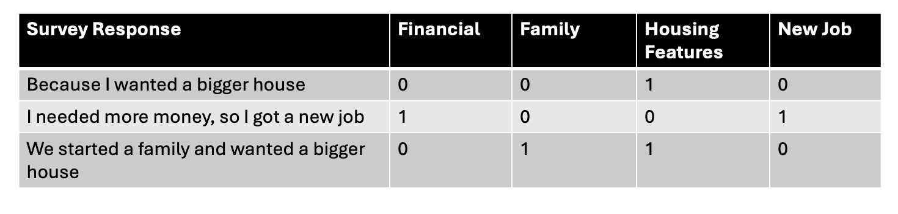
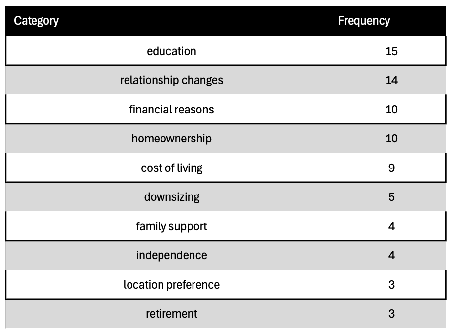

# Summary

The rapid advancement of large language models (LLMs) and vision models
has opened new possibilities for automated text and image analysis in
social science research [@schulze_buschoff_visual_2025;
@yang_large_2024; @sachdeva_normative_2025]. Researchers increasingly
seek to leverage these powerful tools for tasks such as coding
open-ended survey responses, categorizing qualitative data, and
analyzing visual content at scale. However, the field faces significant
reproducibility challenges due to inconsistent output formatting across
different models, varying API interfaces, and the lack of standardized
workflows for integrating LLM outputs into traditional statistical
analysis pipelines [@rossi_problems_2024]. The majority of research
applications require systematic approaches to ensure consistent,
structured data extraction that can be readily analyzed using
established quantitative methods.

# Statement of need

`CatLLM` is a Python package designed for researchers conducting text
and image analysis using large language and vision models. The package
was designed to provide a standardized, function-based interface to
common research operations such as categorical text extraction,
corpus-level analysis, multi-feature image classification, and quality
assessment workflows.

The package can be easily installed and implemented:

```         
pip install cat-llm

import catllm
```

For comprehensive documentation and detailed installation instructions,
see <https://github.com/chrissoria/cat-llm>.

`CatLLM` incorporates several essential features for academic research
workflows. The package includes built-in validation mechanisms to ensure
user-entered categories function as intended, preventing common
specification errors that can compromise analysis quality. Comprehensive
error handling protects researchers from mid-job failures that could
result in lost API costs and unsaved progress, while automatic progress
saving to local files provides additional data security. Cost-saving
functionality automatically skips NA rows rather than processing empty
entries, optimizing API usage efficiency. The package supports multiple
providers including OpenAI, Anthropic, Mistral, and Perplexity Llama
models, allowing researchers to select optimal services for their
specific analytical needs. Additionally, users can enhance task
specificity by inputting research hypotheses and detailed survey
question or image descriptions, enabling more contextually appropriate
model responses.

`CatLLM` integrates seamlessly with standard data science libraries
including pandas for data manipulation and provides direct CSV export
functionality for compatibility with statistical software packages. The
package was designed for social scientists, digital humanities
researchers, and students conducting qualitative-to-quantitative data
analysis. It has already been applied in research comparing LLM
performance across demographic groups using the UC Berkeley Social
Networks Study [@soria_empirical_2025], demonstrating effectiveness in
real-world survey analysis scenarios. Additional applications showcase
the package's versatility across diverse research domains, including
categorizing job types according to Standard Occupational Classification
(SOC) codes and scoring drawn images from cognitive assessments in the
Caribbean-American Dementia and Aging Study
[@llibre-guerra_caribbean-american_2021].

The package demonstrates practical applications through its
implementation of cognitive assessment tools that combine the
image_multi_class and image_score_drawing functions. Specifically, the
package includes automated scoring capabilities for Consortium to
Establish a Registry for Alzheimer's Disease (CERAD) constructional
praxis tasks, where users input the target shape (circle, diamond,
overlapping rectangles, or cube) and receive scores consistent with
official CERAD protocols [@fillenbaum_cerad_2008]. The function provides
full transparency by outputting the scoring criteria used in its
decision-making process, enabling researchers to understand and
customize the assessment logic. This implementation serves as a
foundational framework that can be adapted for other drawing-based
cognitive tests and neuropsychological assessments requiring systematic
visual analysis of respondent-generated drawings.

# Overview of Methods

### Theme Extraction from Single Inputs



The `CatLLm` package processes user-provided text (open-ended survey
responses) or image data and returns structured JSON objects for each
input row. The package enables users to customize function behavior by
incorporating their specific research questions and background
theoretical frameworks, allowing the language models to generate more
contextually relevant and theoretically grounded outputs tailored to
their analytical objectives. The system handles errors gracefully by
generating compatible JSON objects that maintain data structure
integrity, allowing continuous processing without halting execution or
losing user progress.

The multi_class function operates on a binary matrix $M$ of shape
$(n_{\text{rows}}, n_{\text{categories}})$ where
$i \in {1, \dots, n_{\text{rows}}}$ indexes input objects and
$j \in {1, \dots, n_{\text{categories}}}$ indexes categories.

\begin{equation}\label{eq:binary_matrix}
M_{i,j} = \begin{cases}
1 & \text{if the $i$-th object is annotated with category $j$} \\
0 & \text{otherwise}
\end{cases}
\end{equation}

This standardized matrix format enables systematic comparison across
different annotation methods regardless of the underlying model or
approach. Each row represents a text or image input, while each column
represents a categorical classification.

The package extends this framework through specialized functions:

-   **`image_multi_class`**: Applies the binary classification framework
    to vision models, extracting categorical presence/absence from
    images
-   **`image_features`**: Uses the same structure but returns flexible
    outputs (numeric, string, or categorical) rather than binary
    classifications\
-   **`image_score_drawing`**: Compares user drawings against reference
    images, outputting quality scores based on similarity metrics
-   **`cerad_drawn_score`**: Implements standardized CERAD scoring
    protocols for geometric shape drawings. The score is calculated as
    the sum of present categories necessary to score "points" on the
    drawing.

This modular approach provides researchers with consistent data
structures across text and image analysis workflows while maintaining
compatibility with standard statistical analysis tools.

The output consistency rate represents the percentage of successful
attempts where models correctly structure their responses into valid
JSON format across 750 repeated API calls. This metric is crucial for
automated data processing workflows, as inconsistent formatting can
break downstream parsing operations and require manual intervention.
This measurement is particularly important because JSON parsing failures
in production systems can lead to application errors, increased
processing costs, and the need for extensive error handling mechanisms.
The consistency rates shown reflect each model's inherent ability to
follow formatting instructions without relying on specialized structured
output features or post-processing correction tools.

The table below displays each model's ability to maintain consistent
JSON formatting without additional structured output constraints:

::: text-center
**Table 1:Model Output Error Rate**
:::

| Model                                | Parameters | Output Consistency Rate |
|---------------------------------|----------------|----------------------|
| gpt-4o (11-20-2024)                  | \~200B     | 100%                    |
| claude sonnet 3.7 (02-19-2025)       | \~175      | 99.9%                   |
| llama 3.1 (Sonar-Large) (07-01-2024) | \~405B     | 94.1%                   |
| mistral large (07-01-2024)           | \~123B     | 99.6%                   |

### Theme Extraction from an Entire Corpus

For identifying themes at the corpus level, the package uses a process
that breaks the entire corpus into several random chunks. In this
context, a "corpus" refers to a large collection of text documents (such
as survey responses, interviews, or social media posts), and "themes"
are the main topics or recurring ideas that appear throughout the text.
From each chunk, a set number of themes are extracted. These themes from
all chunks are then combined into a larger list that may include
duplicates, reflecting how often each theme appears across different
parts of the corpus.

This method allows the package to count how frequently each theme occurs
throughout the entire corpus by considering all chunks together. Themes
that appear more often are ranked higher, helping to highlight the most
consistent and robust themes across the corpus. This approach also helps
to filter out less reliable themes that might only appear in specific
sections or could be the result of errors in the model's output.

{width="500" fig-align="center"}

The package preserves duplicate theme occurrences rather than treating
themes as a unique set, enabling meaningful frequency analysis across
corpus segments. When themes are extracted from multiple chunks, the
system counts how many times each theme appears across all chunks
combined.

The final output presents themes ranked by their frequency counts in
descending order, creating a prioritized list where the most
consistently appearing themes receive the highest rankings. This chunked
approach proves particularly valuable for identifying robust thematic
patterns that emerge consistently across different corpus segments while
filtering out themes that may result from localized content variations
or potential model inconsistencies.

This ensures that researchers can identify the most significant and
reliable themes present throughout their entire corpus, rather than
themes that might only appear in isolated sections due to
content-specific variations or processing anomalies.

# Acknowledgements

This work was supported by the UC Berkeley Mentored Research Award. The
author thanks Claude Fischer and William Dow for their guidance
throughout this project, and Ty Dow for assistance in testing the
functions on real data. The author also acknowledges the University of
California, Berkeley for providing the institutional support that
enabled this research.

Partial support was provided by the Center on the Economics and
Demography of Aging, P30AG012839, and the Greater Good Science Center's
Libby Fee Fellowship.

# References
