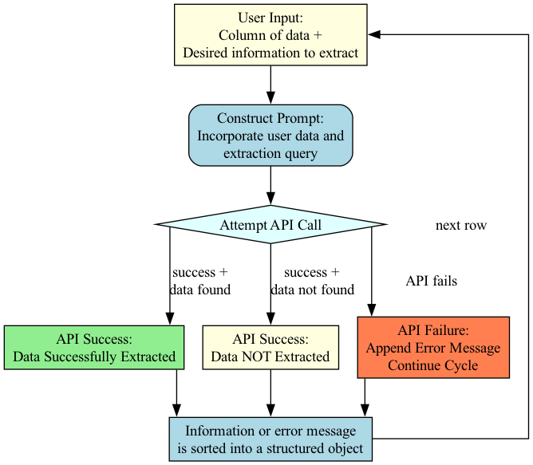

# Summary

The rapid advancement of large language and vision models has created
new opportunities for automated text and image analysis in social
science research [@schulze_buschoff_visual_2025; @yang_large_2024;
@sachdeva_normative_2025]. Researchers increasingly use these tools to
code open-ended survey responses, categorize qualitative data, and
analyze visual content at scale. Yet challenges persist due to
inconsistent output formats, diverse API interfaces, and the lack of
standardized workflows for integrating both model outputs and external
data sources into traditional statistical analysis pipelines
[@rossi_problems_2024]. CatLLM addresses these issues by providing a
modular framework with specialized functions that not only ensure
consistent data structures across text and image analysis workflows, but
also facilitate the automated retrieval of structured data from the web.
The package handles different prompting strategies reactively through
configurable parameters that allow users to switch between techniques
such as Chain-of-Thought (CoT) [@wei_chain_thought_2023],
Chain-of-Verification (CoVe) [@dhuliawala_chain_verification_2023], and
step-back prompting [@zheng_take_2024], enabling researchers to optimize
model reasoning based on task complexity without requiring expertise in
prompt engineering. This integration allows researchers to seamlessly
combine large model outputs with real-world datasets, maintaining
compatibility with standard statistical analysis tools.

# Statement of need

Social scientists increasingly recognize the value of open-ended survey
input for capturing rich, nuanced responses that closed-ended formats
cannot provide. However, many researchers avoid incorporating open-ended
input into their surveys due to the substantial analysis challenges they
present. The processing of open-ended responses is notoriously
time-intensive, requiring manual categorization and careful
interpretation that can quickly become overwhelming with large datasets.
Even when researchers do include open-ended questions, quantitative
researchers often fail to fully utilize the resulting qualitative data
due to limited time, resources, or expertise in analysis techniques.
This analysis burden not only increases research costs but also creates
practical barriers that prevent researchers from leveraging the deeper
insights that open-ended responses can provide.

Current solutions present several limitations for academic researchers
analyzing open-ended survey data. General-purpose natural language
processing libraries such as NLTK require significant programming
knowledge and often involve complex workflows for custom model training,
while tools like spaCy, though more user-friendly, still require domain
expertise for specialized applications. Commercial platforms like
Dedoose or Atlas.ti focus primarily on manual coding workflows and lack
integration with modern language models. While some researchers have
begun using large language models (LLMs) directly through web
interfaces, this approach lacks standardization, reproducibility, and
systematic output formatting necessary for quantitative analysis.

`CatLLM` addresses these gaps by providing a standardized, free-to-use
interface for applying state-of-the-art language and vision models to
common research tasks without requiring machine learning expertise. The
package enables researchers to transform diverse data sources—from
open-ended survey responses and qualitative interviews to unstructured
web content—into quantitative datasets suitable for statistical
analysis, bridging the gap between traditional research methods and
computational approaches. Recent research demonstrates that LLMs from
OpenAI and Anthropic, particularly GPT-4, can effectively replicate
human analysis performance in content analysis tasks, with some studies
showing LLMs achieving higher inter-rater reliability than human
annotators in sentiment analysis and political leaning assessments
[@bojic_comparing_2025]. Unlike existing tools, CatLLM provides
reproducible, structured outputs while supporting multiple AI providers
and maintaining cost efficiency through built-in optimization features.


The software has demonstrated practical impact across diverse research
domains. It has been successfully applied by institutional researchers
at UC Berkeley to track student experience and outcomes, in studies
examining demographic differences in LLM performance using the UC
Berkeley Social Networks Study [@soria_empirical_2025], categorizing
occupational data according to Standard Occupational Classification
codes, and implementing automated scoring for cognitive assessments in
the Caribbean-American Dementia and Aging Study
[@llibre-guerra_caribbean-american_2021]. These applications demonstrate
the package's versatility in addressing real-world research challenges
that require systematic analysis of unstructured data at scale.

## Performance and Reliability

To evaluate CatLLM's reliability across different language model providers, we processed 3,208 open-ended survey responses from the UC Berkeley Social Networks Study using eight models. Table 1 reports success rates, processing times, and costs for each model.

| Metric | GPT-5 | Claude Sonnet 4.5 | Gemini 2.5 Flash | Grok-4 Fast | Mistral Medium | Llama 4 | DeepSeek v3.1 | Qwen 3 |
|--------|-------|-------------------|------------------|-------------|----------------|---------|---------------|--------|
| Success Rate (%) | 100 | 99.97 | 99.44 | 100 | 99.94 | 100 | 99.91 | 99.84 |
| Failure Count | 0 | 1 | 18 | 0 | 2 | 0 | 3 | 5 |
| Cost ($) | 27.85 | 19.31 | 0.94 | 0.46 | 0.38 | 2.54 | 2.54 | 2.54 |
| Processing Time (H:MM) | 7:27 | 2:55 | 1:00 | 0:49 | 1:23 | 0:23 | 2:23 | 2:45 |

Table: Model performance metrics for processing 3,208 survey responses. Success rate indicates percentage of responses successfully categorized. Costs reflect API pricing at time of testing. {#tbl-performance}

All models achieved success rates above 99%, with failures primarily attributable to transient server errors rather than JSON processing issues. The results demonstrate substantial cost variation across providers: closed-source models like GPT-5 offer high reliability but at premium pricing ($27.85), while open-weights alternatives like Mistral Medium and the Groq-hosted models provide comparable success rates at a fraction of the cost ($0.38–$2.54). Processing times ranged from 23 minutes (Llama 4) to over 7 hours (GPT-5), reflecting differences in API rate limits and model inference speeds.

The package can be easily installed and implemented:

```         
pip install cat-llm

import catllm as cat
```

For comprehensive documentation and detailed installation instructions,
see <https://github.com/chrissoria/cat-llm>.

# Features

The `CatLLM` package processes diverse data sources—including
user-provided text (open-ended survey responses), image data, and
unstructured content retrieved from the web—and returns structured data
objects. The package enables users to customize function behavior by
incorporating their specific research questions and background
theoretical frameworks, allowing the language models to generate more
contextually relevant and theoretically grounded outputs tailored to
their analytical objectives.

The package extends this framework through specialized capabilities:

-   **Web Data Collection**: Retrieves and structures unstructured
    content from web sources, transforming raw online data into
    standardized datasets suitable for analysis alongside survey and
    qualitative data.

-   **Binary Image Classification**: Applies classification frameworks
    to vision models, determining the presence or absence of specific
    categories within images for systematic visual content analysis.

-   **Flexible Image Feature Extraction**: Extracts diverse data types
    from images, returning numeric, string, or categorical outputs
    rather than limiting analysis to binary classifications, enabling
    more nuanced visual data collection.

-   **Drawing Quality Assessment**: Compares user-generated drawings
    against reference images, producing quality scores based on
    similarity metrics for objective evaluation of visual reproduction
    tasks.

-   **Standardized Cognitive Assessment Scoring**: Implements
    established CERAD protocols [@fillenbaum_cerad_2008] for scoring
    geometric shape drawings, calculating standardized scores based on
    the presence of required visual elements for neuropsychological
    evaluation.

-   **Corpus-Level Theme Discovery**: Identifies and ranks themes across
    large text collections by systematically analyzing random corpus
    segments, extracting recurring topics, and prioritizing themes based
    on their frequency and consistency across different sections.

This modular approach provides researchers with consistent data
structures across text, image, and web data analysis workflows while
maintaining compatibility with standard statistical analysis tools.




# Acknowledgements

This work was supported by the UC Berkeley Mentored Research Award. The
author thanks Matthew Stenberg, Sara Quigley, Madeline Arnold, and Henry
Tyler Dow for assistance in testing the functions on real data. The
author also acknowledges the University of California, Berkeley for
providing the institutional support that enabled this research.

Partial support was provided by the Center on the Economics and
Demography of Aging, P30AG012839, and the Greater Good Science Center's
Libby Fee Fellowship.

# References
