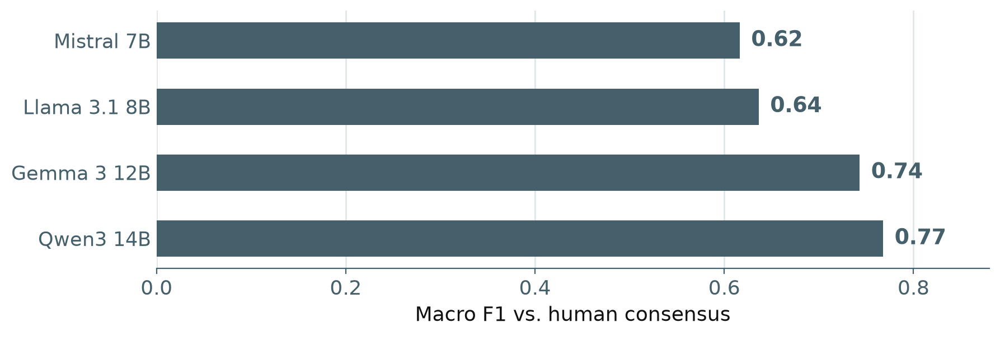
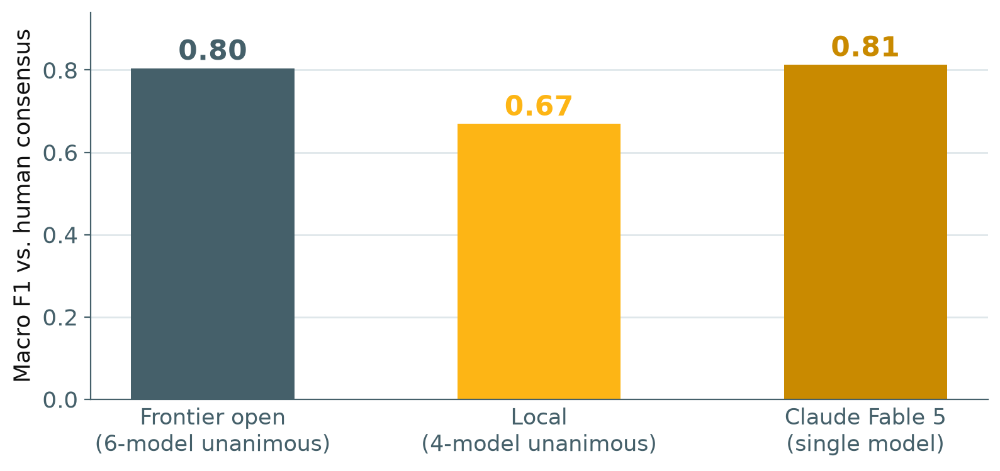

::: {.poster-shell}

:::: {.poster-top}
::: {.top-left}
{.top-qr}

**Scan for the package,**<br>**the do-file, and this poster**
:::

::: {.top-center}
# Coding Open-Ended Survey Text Without Leaving Stata:<br>the `catllm` Package for LLM-Assisted Content Coding

::: {.authors}
Chris Soria^1^
:::

::: {.affils}
^1^Department of Demography, University of California, Berkeley
:::
:::

::: {.top-right}
{.org-logo .seal}
{.org-logo .catllm}
:::
::::

:::: {.poster-columns}
::: {.poster-column}
::: {.section-block}
## Abstract

Open-ended survey items capture what closed-ended items cannot, and are routinely dropped from analysis because hand-coding them does not scale. `catllm` is a Stata command that codes free-text responses with large language models and returns ordinary Stata indicator variables. It wraps a Python backend (`cat-stack`) behind five verbs: `extract`/`explore` find categories, `classify` applies them, and `summarize`/`setup` close the loop, across eight providers from OpenAI and Anthropic to fully local Ollama. Tested on multi-label, multi-class items, proprietary models agree with human coders on **97%** of straightforward items and **88–91%** of complex interpretive ones. Models tend to over-classify; three frontier-open models under unanimous voting correct for it, reaching **0.85** precision against Claude Fable 5's **0.78** at little cost in recall: a more balanced classification.
:::

::: {.section-block}
## The Problem

- Researchers already use LLMs to code open-ended text, but little guidance exists for keeping classifications aligned with intended meaning without skewing conclusions.
- Model choice is often arbitrary. Researchers overpay for models that excel at general tasks, which rarely predicts coding accuracy.
- **Over-classification** is the dominant error: with several categories per response, models tend to assign labels too liberally, especially on ambiguous text. Recall looks fine; precision does not.
- Doing this from Stata usually means exporting to CSV, scripting in Python, and re-merging, which loses the audit trail that makes coding reproducible.
- **Aim:** put the whole loop inside Stata, with evidence-based levers on accuracy and over-classification: category definitions, model choice, and cross-provider unanimous consensus.
:::

::: {.section-block .results-block}
## The Pipeline


::: {.fig-note}
`generate()` is a prefix, not a variable name: a five-category scheme returns five 0/1 byte variables. `extract`'s specificity, iteration count, and category limit are tunable, so discovery matches the research question instead of a fixed default.
:::
:::

::: {.section-block .code-block}
## One Command

```stata
local cats                                          ///
  "Housing cost: Moved over rent, a mortgage, or affordability." ///
  "Employment: Moved for a job, a transfer, or school." ///
  "Family: Moved for caregiving or to be near relatives." ///
  "Other: Does not fit any of the above categories."

catllm classify response,                           ///
    categories(`cats')                              ///
    apikey($ANTHROPIC_API_KEY)                      ///
    model("claude-fable-5-1")                       ///
    generate(reason)

tab1 reason_*
regress reason_Housing_cost age female
```

::: {.fig-note}
Each category is a full sentence and `Other` is explicit. `catllm` warns on terse labels and offers to add a missing `Other` before coding: without a catch-all, the model must guess on responses that fit nothing.
:::
:::

::: {.section-block}
## References

Soria (2026). *CatLLM: A Python package for generating, assigning, and scoring open-ended survey data and images.* | Soria (2026). *High agreement, different stories.* | Soria (2026). *Model diversity over model size.* | Bojic et al. (2025). *Comparing LLM and human annotators.* | Wei et al. (2023). *Chain-of-thought prompting.* | Dhuliawala et al. (2023). *Chain-of-verification.* | Zheng et al. (2024). *Step-back prompting.*
:::
:::

::: {.poster-column}
::: {.section-block .results-block}
## Accuracy Against Human Coders


::: {.fig-note}
UC Berkeley Social Networks Study validation: macro F1 against human consensus, averaged across three survey questions so no single question dominates. Frontier-closed, economy-closed, and frontier-open tiers overlap closely; Claude Fable 5, shown individually, lands in line with the top cloud tiers. Ranges span the models within each tier.
:::
:::

::: {.section-block}
## What Moves Accuracy

- **Descriptive categories.** Writing each category as a sentence beats one-word labels on every model tested; `catllm` checks the scheme for terse labels and a missing `Other` before any response is coded.
- **Ensembles, where they pay.** Unanimous voting over diverse models lifts precision most on interpretive categories and buys little on clear ones; `consensus()` plus per-response agreement scores let you apply it where it helps.
- **Minimal prompting by default.** Chain-of-thought, step-back, and expert-persona prompts add tokens without improving survey coding in our tests, so they are opt-in flags, not defaults: cheaper runs, same accuracy.
- **Every tier through one command.** Frontier, economy, open-weight, and local models across eight providers are a `model()` argument away, so switching tiers is a parameter change, not a rewrite.
:::

::: {.section-block .results-block}
## Local Model Spread



::: {.fig-note}
Same macro F1 against human consensus as the cloud tiers, for the four laptop-scale Ollama models. The spread here (0.62–0.77) is about double the cloud tiers' (0.76–0.83): picking well matters far more once you're local.
:::
:::

::: {.section-block .results-table}
## Choosing a Route

```{=html}
<table>
  <thead>
    <tr><th>Route</th><th>Cost</th><th>Speed</th><th>Error profile</th><th>Data leaves machine</th></tr>
  </thead>
  <tbody>
    <tr><td>Frontier proprietary</td><td>High</td><td>Slow</td><td>Tends to over-classify</td><td>Yes</td></tr>
    <tr><td>Small proprietary</td><td>Low</td><td>Fast</td><td>Tends to over-classify</td><td>Yes</td></tr>
    <tr class="highlight"><td>Multi-vendor unanimous ensemble</td><td>Sum of parts</td><td>Slowest member</td><td>Conservative</td><td>Unless all local</td></tr>
    <tr><td>Local open-weight (Ollama)</td><td>$0</td><td>Hardware-bound</td><td>Varies by model</td><td>No</td></tr>
  </tbody>
</table>
```

::: {.fig-note}
Single models of every size tend to assign categories too liberally. A unanimous ensemble of three diverse models corrects for it: pick it when a false positive costs more than a missed code, and when the categories are interpretive, where the precision gain is largest. For restricted-use data under an IRB or data-use agreement, the local route is often the only admissible one, and `catllm` treats it as a first-class route: any Ollama model goes in `model()`, the server starts on demand, and JSON recovery covers the smaller models.
:::
:::
:::

::: {.poster-column}
::: {.section-block .results-block}
## Unanimous Ensembles



::: {.fig-note}
`consensus("unanimous")` assigns a category only if all models agree. Fable 5 assigns 38% more labels than coders on the hardest question. The three best frontier-open models beat it on precision (0.85 vs. 0.78) and F1 (0.85 vs. 0.82) for 3 points of recall: a more balanced coder. The best local trio matches that precision and reaches 0.74 F1 at $0, 8 behind Fable 5; weak members cost recall.
:::
:::

```{=html}
<div class="stat-strip">
  <div class="stat-cell"><span class="big">+38%</span><span class="cap">extra labels on the hardest<br>question, Claude Fable 5</span></div>
  <div class="stat-cell"><span class="big">0.85</span><span class="cap">precision, top-3 frontier-open<br>unanimous ensemble</span></div>
  <div class="stat-cell"><span class="big">$0</span><span class="cap">fully local<br>route</span></div>
</div>
```

::: {.key-findings}
## Key Findings

- [1 command]{.stat-number} [**Code text without leaving Stata.** `catllm classify` turns a string variable into 0/1 indicators ready for `tab` and `regress`; `extract` discovers the categories first, so the codebook comes from the data, not a guess]{.stat-label}
- [0.85 vs. 0.78]{.stat-number} [**Run an ensemble with one option.** `consensus("unanimous")` over three diverse models reaches 0.85 precision against 0.78 for Claude Fable 5 and beats it on F1, correcting for over-classification with no hand-merging]{.stat-label}
- [8 providers]{.stat-number} [**Choose the route your data allows.** One command runs on OpenAI, Anthropic, Google, Mistral, xAI, HuggingFace, Perplexity, or fully local Ollama at $0, where the package auto-starts the server and recovers JSON from small models]{.stat-label}
:::

::: {.section-block .code-block}
## Reproduce This

Everything on this poster runs from one self-contained do-file: no data downloads, no file paths, guarded so it completes with a single API key or with none at all.

```stata
net install catllm, ///
  from("https://raw.githubusercontent.com/chrissoria/cat-llm/main/stata-package/") ///
  replace

catllm setup
do catllm_stata_conference.do
```

The file walks the full pipeline: classify, analyze the resulting indicators, compare three providers, run an ensemble with agreement scores, discover a coding scheme with `extract`, and repeat the whole thing locally at zero cost. Nine further worked examples ship with the package.
:::

::: {.section-block}
## Limitations

- **Concordance with human coders is not validity.** Where humans systematically misread a response, an agreeing model does too; agreement measures replication of a benchmark, not correctness.
- **Validation is strongest on English-language survey text** of the kind studied here. Performance on other languages, registers, and domains needs separate checking on your own data.
- **Unanimity trades recall for precision.** On the most interpretive question the top-3 ensemble gives up 11 points of recall against Fable 5 to gain 11 of precision; weak local members triple that cost. Choose by what a false positive versus a missed code costs you.
- **The ensemble evidence here is small.** Three questions at 175 responses each, one interpretive, and the trio was picked on the data it is scored on (17 of 20 trios still beat Fable 5 on F1). The pattern replicates on 3,208 responses and 16 earlier models in Soria (2026), *Model diversity*.
:::

:::
::::

:::: {.poster-footer}
::: {.footer-left}
&nbsp;
:::

::: {.footer-center}
github.com/chrissoria/cat-llm · `net install catllm` from the repo (see Reproduce This)
:::

::: {.footer-right}
chrissoria@berkeley.edu
:::
::::

:::
