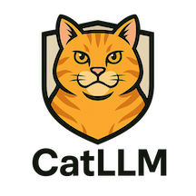
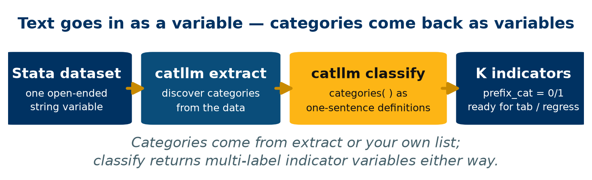
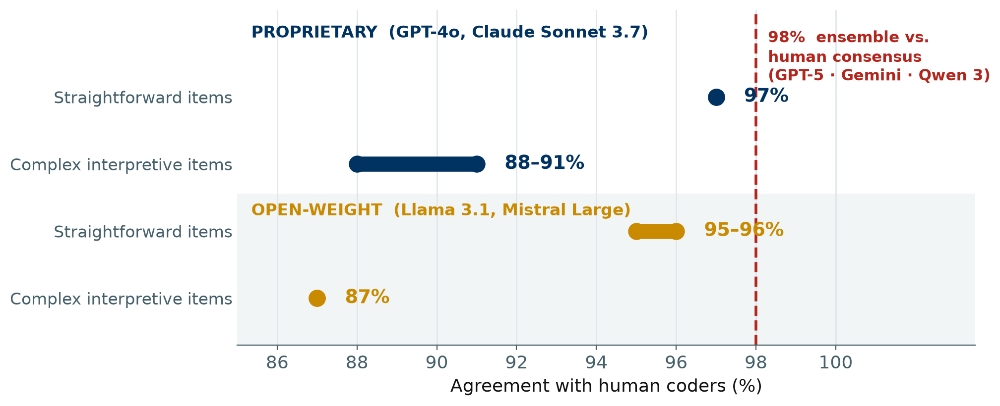
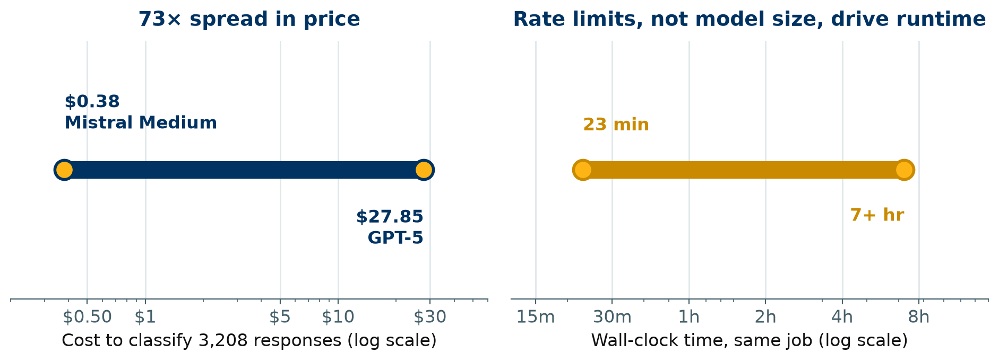
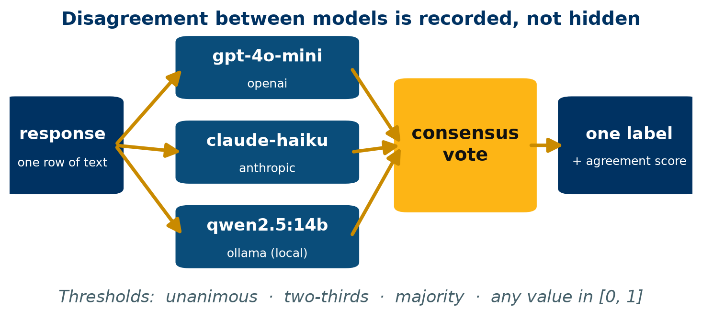

::: {.poster-shell}

:::: {.poster-top}
::: {.top-left}
{.top-qr}

**Scan for the package,**<br>**the do-file, and this poster**
:::

::: {.top-center}
# Coding Open-Ended Survey Text Without Leaving Stata:<br>the `catllm` Package for LLM-Assisted Content Coding

::: {.authors}
Chris Soria^1^
:::

::: {.affils}
^1^Department of Demography, University of California, Berkeley
:::
:::

::: {.top-right}
{.org-logo}
:::
::::

:::: {.poster-columns}
::: {.poster-column}
::: {.section-block}
## Abstract

Open-ended survey items capture what closed-ended items cannot, and are routinely dropped from analysis because hand-coding them does not scale. `catllm` is a Stata command that codes free-text responses with large language models and returns ordinary Stata indicator variables. It wraps a Python backend (`cat-stack`) behind five verbs — `classify`, `extract`, `explore`, `summarize`, `setup` — and supports OpenAI, Anthropic, Google, and local open-weight models through Ollama. Against human coders, proprietary models agree on **97%** of straightforward items and **88–91%** of complex interpretive ones; a multi-model ensemble reaches **98%** agreement with human consensus. Because the same job costs between **\$0.38 and \$27.85** depending on vendor, and because models disagree most on exactly the responses humans find hardest, the package reports vote-level disagreement rather than hiding it behind a single label.
:::

::: {.section-block}
## The Problem

- A single open-ended item in a 3,000-respondent survey is weeks of RA time to code, and the coding is rarely re-audited once done.
- The usual response is to drop the item, or to code a subsample and generalize from it.
- Researchers who do reach for an LLM typically leave their statistical environment: export to CSV, script in Python, re-merge, and lose the audit trail that makes the coding reproducible.
- **Aim:** put the whole loop inside Stata, so that coding an open-ended item is as reproducible, and as inspectable, as recoding a closed-ended one.
:::

::: {.section-block .results-block}
## The Pipeline



::: {.fig-note}
`generate()` is a prefix, not a variable name: a five-category scheme returns five 0/1 byte variables. Coding is multi-label by construction, so a move that is both a job move and a cost-of-living move is recorded as both.
:::
:::

::: {.section-block .code-block}
## One Command

```stata
local cats                                          ///
  "Housing cost: Moved over rent, a mortgage, or affordability." ///
  "Employment: Moved for a job, a transfer, or school." ///
  "Family: Moved for caregiving or to be near relatives." ///
  "Other: Does not fit any of the above categories."

catllm classify response,                           ///
    categories(`cats')                              ///
    apikey($OPENAI_API_KEY)                         ///
    model("gpt-4o-mini")                            ///
    generate(reason)

tab1 reason_*
regress reason_Housing_cost age female
```

::: {.fig-note}
Category definitions, not one-word labels: writing each category as a sentence classifies several percentage points better on every model tested. An explicit `Other` category is required, not optional — without it the model must guess on responses that genuinely fit nothing.
:::
:::

::: {.section-block}
## References

Soria (2026). *CatLLM: A Python package for generating, assigning, and scoring open-ended survey data and images.* | Bojic et al. (2025). *Comparing LLM and human annotators.* | Wei et al. (2023). *Chain-of-thought prompting.* | Dhuliawala et al. (2023). *Chain-of-verification.* | Zheng et al. (2024). *Step-back prompting.*
:::
:::

::: {.poster-column}
::: {.section-block .results-block}
## Accuracy Against Human Coders



::: {.fig-note}
UC Berkeley Social Networks Study validation: four models against human annotators, across items of differing interpretive difficulty. Open-weight models trail proprietary ones by 1–2 points on straightforward items and converge with them on complex ones. Ranges span the models within each family.
:::
:::

::: {.section-block}
## What Moves Accuracy

- **Task difficulty dominates model choice.** The gap between straightforward and interpretive items (≈9 points) is far larger than the gap between the best and worst model on a given item (1–2 points).
- **Response brevity helps.** Responses under 50 characters are classified 7–11 points more accurately than long ones.
- **Demographic variation is minimal.** Accuracy is stable across population segments — an essential precondition for using coded output in stratified analysis.
- **Structured output is not the bottleneck.** Across 8 models × 3,208 responses (25,664 classifications), 100% of successful calls returned valid structured output; the 0–18 failures per model were transient server errors, not parsing failures.
:::

::: {.section-block .results-block}
## Provider Comparison



::: {.fig-note}
The same 3,208-response job, priced and timed across 8 models. Cost varies by a factor of 73 and wall-clock time by a factor of 18 — the latter driven by vendor rate limits rather than model size. Cost and accuracy are only loosely coupled, so the expensive model is frequently the wrong default.
:::
:::

::: {.section-block .results-table}
## Choosing a Route

```{=html}
<table>
  <thead>
    <tr><th>Route</th><th>Cost</th><th>Speed</th><th>Data leaves machine</th></tr>
  </thead>
  <tbody>
    <tr><td>Frontier proprietary</td><td>High</td><td>Slow</td><td>Yes</td></tr>
    <tr><td>Small proprietary</td><td>Low</td><td>Fast</td><td>Yes</td></tr>
    <tr class="highlight"><td>Multi-vendor ensemble</td><td>Sum of parts</td><td>Slowest member</td><td>Yes</td></tr>
    <tr><td>Local open-weight (Ollama)</td><td>$0</td><td>Hardware-bound</td><td>No</td></tr>
  </tbody>
</table>
```

::: {.fig-note}
For restricted-use data under an IRB or data-use agreement, the local route is often the only admissible one — and it is the route the package defaults to protecting, auto-starting the local server and enabling JSON recovery for smaller models.
:::
:::
:::

::: {.poster-column}
::: {.section-block .results-block}
## Ensemble & Consensus Voting



::: {.fig-note}
`models()` takes several model/provider pairs; `consensus()` sets the bar for assigning a category. Cloud and local models can be mixed freely in one ensemble. Alongside each label the package returns an agreement score, so the rows where models split are identifiable rather than silently averaged away.
:::
:::

```{=html}
<div class="stat-strip">
  <div class="stat-cell"><span class="big">98%</span><span class="cap">ensemble vs.<br>human consensus</span></div>
  <div class="stat-cell"><span class="big">25,664</span><span class="cap">benchmark<br>classifications</span></div>
  <div class="stat-cell"><span class="big">$0</span><span class="cap">fully local<br>route</span></div>
</div>
```

::: {.key-findings}
## Key Findings

- [97% / 88–91%]{.stat-number} [Agreement with human coders on straightforward vs. complex interpretive items. The ceiling is set by how interpretive the question is, not by which vendor you pay]{.stat-label}
- [98%]{.stat-number} [A three-model ensemble agrees with human consensus more often than any single model in it — disagreement between models is informative, not noise]{.stat-label}
- [73×]{.stat-number} [Cost spread across vendors for an identical job. Cost tracks accuracy only loosely, so the default choice should be justified rather than assumed]{.stat-label}
:::

::: {.section-block .code-block}
## Reproduce This

Everything on this poster runs from one self-contained do-file — no data downloads, no file paths, guarded so it completes with a single API key or with none at all:

```stata
net install catllm, ///
  from("https://raw.githubusercontent.com/chrissoria/cat-llm/main/stata-package/") ///
  replace

catllm setup
do catllm_stata_conference.do
```

The file walks the full pipeline: classify, analyze the resulting indicators, compare three providers, run an ensemble with agreement scores, discover a coding scheme with `extract`, and repeat the whole thing locally at zero cost. Eight further worked examples ship with the package.
:::

::: {.section-block}
## Limitations

- **Concordance with human coders is not validity.** Where humans systematically misread a response, an agreeing model does too; agreement measures replication of a benchmark, not correctness.
- **Validation is strongest on English-language survey text** of the kind studied here. Performance on other languages, registers, and domains needs separate checking on your own data.
- **Models are moving targets.** A model version can be deprecated or silently updated, so the version string belongs in your methods section alongside the seed.
- **Smaller local models are less tested.** The published benchmarks use high-end models; the low end warrants its own validation before use in production coding.
:::

:::
::::

:::: {.poster-footer}
::: {.footer-left}
**Funding:** UC Berkeley Mentored Research Award; CEDA P30AG012839
:::

::: {.footer-center}
github.com/chrissoria/cat-llm · `ssc install catllm`
:::

::: {.footer-right}
chrissoria@berkeley.edu
:::
::::

:::
