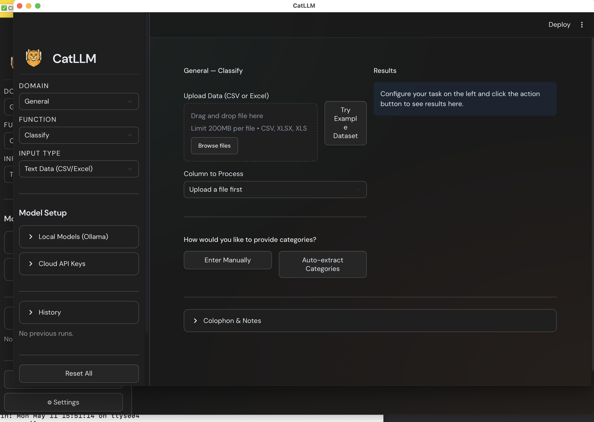

# CatLLM Desktop

A native macOS app for classifying open-ended survey responses, PDFs, and
images using Large Language Models. Wraps the [`cat-llm`](https://pypi.org/project/cat-llm/)
Python package in a self-contained bundle — no Python install required.



## Install (first time)

1. Download the latest DMG from **[Files and versions](https://huggingface.co/chrissoria/catllm-desktop/tree/main)**:
   - **Apple Silicon (M1/M2/M3/M4):** `CatLLM-X.Y.Z-arm64.dmg`
   - **Intel Macs:** `CatLLM-X.Y.Z-x86_64.dmg`
2. Open the DMG and drag **CatLLM** to your **Applications** folder.
3. **First launch only:** macOS will show *"Apple cannot check it for malicious
   software."* This is expected for unsigned indie apps.
   - **Right-click** (or Control-click) **CatLLM** in Applications →
     **Open** → click **Open** in the dialog.
   - After that one time, it launches like any other app from Spotlight,
     Launchpad, or the Dock.

## Verify your download (optional)

Each DMG has a matching `.sha256` file. Verify with:

```bash
shasum -a 256 -c CatLLM-X.Y.Z-arm64.dmg.sha256
```

## What you can do

| Function | Purpose |
|---|---|
| **Classify** | Assign categories (manual or auto-extracted) to text / PDF / images |
| **Extract** | Discover categories from your data |
| **Explore** | Saturation analysis for category discovery |
| **Summarize** | Generate concise summaries |

Across 9 LLM providers (OpenAI, Anthropic, Google, Mistral, Perplexity, xAI,
HuggingFace, Ollama, and more) and 7 domain packs (General, Survey, Social
Media, Academic, Policy, Web, Cognitive).

## Your data stays local

The app runs entirely on your machine. Only the text you classify is sent to
your chosen LLM provider's API. **Do not upload sensitive, confidential, or
personally identifiable information when using cloud providers.** For fully
local inference, use the bundled Ollama integration.

## Getting an API key

You'll need at least one provider key. Most users start with:

- **OpenAI** — `platform.openai.com/api-keys`
- **Anthropic** — `console.anthropic.com/settings/keys`
- **Google AI Studio** — `aistudio.google.com/apikey`

Paste keys in the **Cloud API Keys** panel in the app sidebar. They're stored
locally on disk only.

## Source code

- Python package: [github.com/chrissoria/cat-llm](https://github.com/chrissoria/cat-llm)
- Desktop wrapper: same repo, `app/` directory

## Citation

```
Soria, C. (2025). CatLLM: A Python package for LLM-based text classification.
DOI: 10.5281/zenodo.15532316
```

## License

[AGPL-3.0](https://github.com/chrissoria/cat-llm/blob/main/LICENSE).
